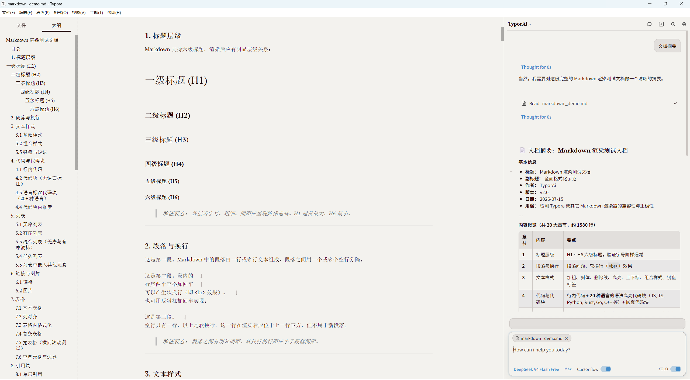
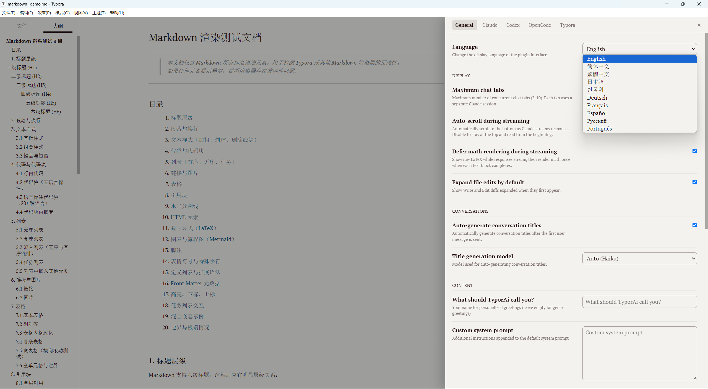
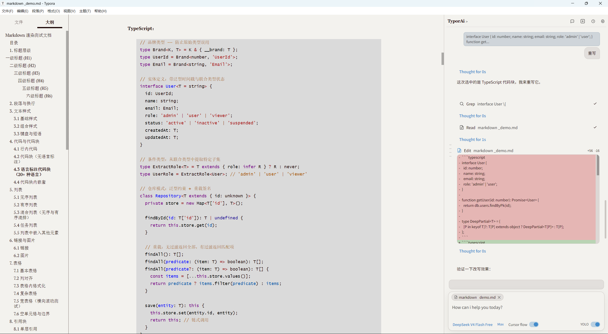

# TyporAi

TyporAi 是运行在 Typora 中的 AI 写作与文档协作插件。它把 AI 对话、当前文档上下文和原位编辑整合到右侧边栏，让你无需离开编辑器即可阅读、提问、改写和完善 Markdown 文档。

> 适用于 Windows 和 Linux 桌面版 Typora。Claude 是默认且功能最完整的提供商；Codex 和 OpenCode 可按需启用。

## 主要功能

- **侧栏 AI 协作**：在 Typora 右侧直接发起多轮对话；回复以流式方式呈现，阅读与写作无需切换应用。
- **理解当前文档**：可读取当前 Markdown 文件并结合内容回答问题、生成摘要、解释段落或继续写作。文档标签会清晰标识本次对话的上下文来源。
- **引用与定向提问**：选中文本后即可将其作为上下文交给 AI，适合逐段润色、校对、扩写和提问。
- **原位改写与差异预览**：AI 可对选中内容或文件提出修改；在应用前展示新增、删除与替换的差异，便于确认每一处变更。
- **会话管理**：支持并行会话、历史恢复、继续会话和分叉对话，长文写作或多任务研究时仍能保持上下文清晰。
- **多提供商运行时**：Claude、Codex 与 OpenCode 使用各自的本地运行时和会话能力；可在设置中独立配置并切换。
- **写作工作流**：支持自定义系统提示、命令、技能、子代理、图片附件和 `#` 指令模式，覆盖摘要、改写、研究、代码解释等日常文档任务。
- **本地优先**：设置和会话元数据保存在项目或 TyporAi 自有目录中，避免读取或迁移旧插件的数据。

## 演示

### 文档摘要与上下文对话

AI 在边栏中读取当前 Markdown 文档并给出结构化摘要，同时保留原文编辑视图。



### 多提供商与界面设置

可配置界面语言、对话行为与提供商专属选项，并在 Claude、Codex、OpenCode 和 Typora 工作流之间切换。



### AI 原位改写

对选中的内容执行改写后，在侧栏中查看红绿差异预览，再决定是否应用修改。



## 安装与部署

需要 Node.js 24 和桌面版 Typora。部署会修改 Typora 的 `window.html`；请先关闭 Typora，并在 Windows 权限不足时使用管理员终端。

### 推荐：交给 AI Agent 安装

在仓库根目录将以下指令交给具备本机文件操作权限的 AI Agent：

```text
请安装并部署 TyporAi 到本机 Typora：确认 Typora 已关闭，执行 npm install、npm run deploy:typora 和 npm run verify:typora。不要修改插件源代码；完成后报告校验结果。若写入 Typora 安装目录时权限不足，请提示我以管理员权限重试。
```

Agent 会自动构建插件、复制部署文件、备份并更新 Typora 加载器，再验证安装结果。

### 手动安装

```bash
npm install
npm run deploy:typora
npm run verify:typora
```

开发插件时可使用：

```bash
npm run typecheck:typora
npm run build:typora
```

插件会安装到：

```text
%APPDATA%\Typora\plugins\typorai
```

Typora 加载器会注入到：

```text
C:\Program Files\Typora\resources\window.html
```

## 开发命令

```bash
npm run dev
npm run typecheck
npm run lint
npm run test
npm run build
```

## 版权与致谢

TyporAi 基于 [Claudian](https://github.com/YishenTu/claudian) 开发，并在其基础上适配 Typora 的编辑体验和多提供商工作流。项目采用 [MIT License](LICENSE)；使用、修改或分发本项目时，请保留许可证文本及相关版权声明。
